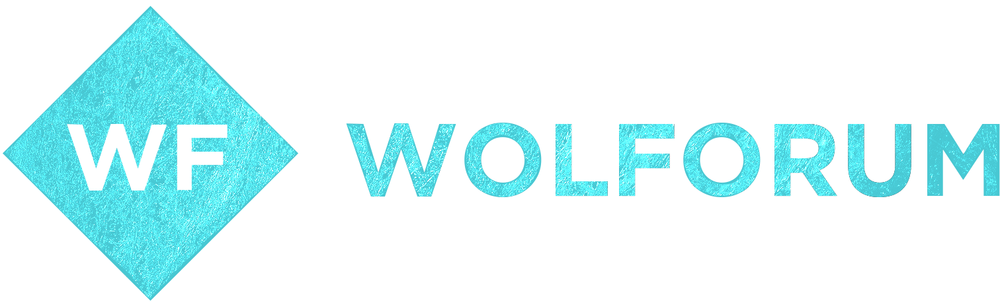
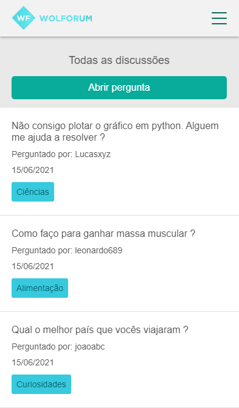

<h1 align="center">
    
</h1>
<h2 align="center"> Desktop <br>
    
</h2>
<h2 align="center"> Mobile <br>
    
</h2>

---

## 📚 Sobre o projeto
<br>

O **Wolforum** é um projeto de um site que foi desenvolvido por nós (atuais membros do ramo) para concluir a fase trainee do processo seletivo para o Ramo Estudantil - IEEE da instituição CEFET/RJ - Maracanã. Este site é um fórum de discussões semelhante ao StackOverflow, e nele é possível criar um usuário, criar discussões, categorias de discussões e responder discussões.

---
## 💻 Tecnologias utilizadas
<br>
Este projeto foi desenvolvido com as seguintes tecnologias:

- Node.js
- Express
- EJS (View engine)
- MySQL (Banco de dados)
- Sequelize (ORM)

---
## 👷 Contribuidores
<br>
Estes foram todos os contribuidores que participaram no projeto:

- [Felipe Júnior](https://github.com/felipe-junior)
- [Lucas Farolfi](https://github.com/lucasfarolfi)
- [Cleyton Prado](https://github.com/Cleytonpsf)
- [João Reis](https://github.com/jvrreis)

---
## 📂 Como instalar o projeto
<br>
Você pode instalá-lo com o Git utilizando o comando:

```

git clone https://github.com/felipe-junior/projeto-ramo.git

```
Após isso, é <span style="color:red;">necessário</span> que você tenha instalado na sua máquina o <span style="color:red;">MySQL</span>. Também será <span style="color:red;">necessário</span> ter instalado o <span style="color:red;">NodeJs</span> em sua máquina para a execução do servidor da aplicação.

Feito isso, podemos executar os seguintes passos:

1. Crie um banco de dados chamado <span style="color:yellow;">"projetoramo"</span>, ou crie um banco com outro nome e vá no arquivo <span style="color:yellow;">"database/databaseConfig.js"</span> e altere o metodo database para o nome do seu banco.

2. Abra o CMD ou PowerShell e entre no diretório do projeto.

3. Execute o comando **<span style="color:yellow;">node</span> index.js**.

4. Acesse a rota https://localhost:8080

5. Pronto, agora sua aplicação está rodando !

---
🚀 Projetado e desenvolvido por: Lucas Farolfi, Felipe Júnior, Cleyton Prado e João Reis.